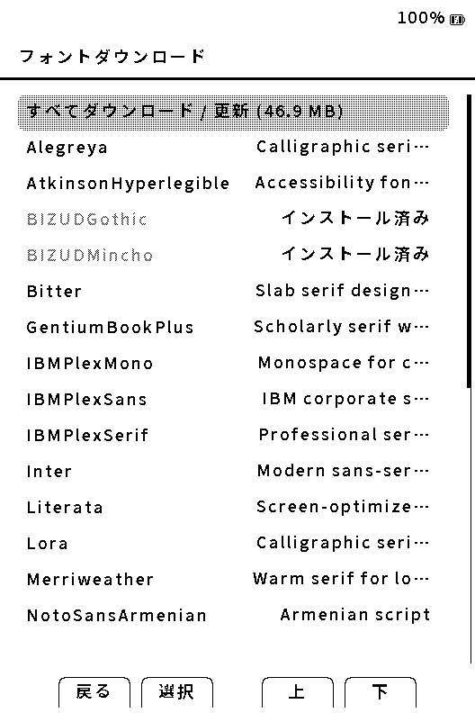
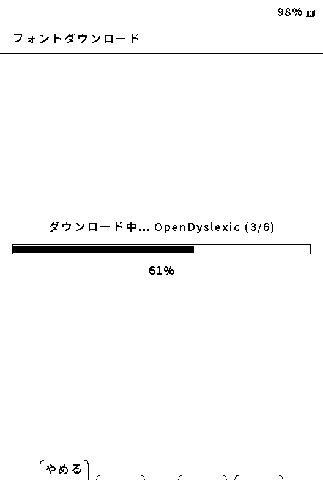

# 日本語フォントの導入

[マニュアルの目次](manual-ja.md)

Yomukaは、読書用の日本語フォントをSDカードへ追加できます。横書き・縦書きの設定で使うフォントを選べるため、書籍や読み方に合わせて明朝・ゴシックを使い分けられます。

## まずは配布ZIPを使う

最も確実な方法は、[SD Card Fontsの配布ページ](https://github.com/ponto1216-ai/crosspoint-jp/releases/tag/sd-fonts)から `Yomuka-Font-<family>.zip` をPCへダウンロードし、ZIPをSDカードのルートへ展開する方法です。

展開後の構成は次のようになります。

```
SDカードのルート
└─ .fonts
   └─ <family>
      └─ *.cpfont
```

導入後は端末を再起動し、**設定 → 読書 → 横書き設定** または **縦書き設定** からフォントを選びます。

配布フォントには、BIZ UD Gothic、BIZ UD Mincho、Noto Sans JP、Noto Serif JPなどがあります。更新済みの日本語フォントにはキリル文字、`℃`、`ℓ`が含まれ、Noto系とZen Maru Gothicには`℉`も含まれます。収録内容とライセンスは各配布物の案内を確認してください。

> [!WARNING]
> Zen Maru Gothicは収録文字が限られるため、日本語書籍の本文では文字が表示できない場合があります。本文用にはBIZ UDまたはNoto系のフォントを推奨します。

## Wi-Fiでダウンロードする

Wi-Fiを設定済みなら、端末の **設定 → 読書 → フォントをダウンロード** から対応フォントを直接導入できます。



一覧では、未導入のフォントは説明、導入済みのフォントは **インストール済み**、配布中のファイルと大きさが異なるものは **アップデート** と表示します。選んで **決定** を押すと確認画面へ進みます。



- ファミリー内に複数のファイルがある場合、`3/6` のように現在のファイル数と全体数を表示します。
- **やめる** を選ぶと、その時点で中止できます。途中まで取得したファイルは、同じフォントを再度選んだときに続きから取得します。
- ダウンロード中も POWER + DOWN でスクリーンショットを保存できます。
- ダウンロード中は電源を切らず、SDカードを抜かないでください。
- 通信が中断した場合は、同じ操作をもう一度実行してください。対応する配布物では途中から再開します。
- ファイルの確認が完了するまで、既に導入済みのフォントは置き換えません。

容量や通信量を抑えたい場合、または安定した回線で作業したい場合は、PCでZIPを展開する方法をおすすめします。

## フォントが一覧に出ない場合

1. SDカードに `/.fonts/<family>/*.cpfont` の形で入っているか確認します。
2. ZIPをフォルダごと二重に展開していないか確認します。`.fonts` がSDカード直下にある必要があります。
3. 端末を再起動してから、横書き・縦書きそれぞれのフォント一覧を開きます。
4. SDカードをPCで読み書きした直後は、安全な取り外しを行ってから端末に戻します。

以前の形式である `/fonts/` や `/.crosspoint/fonts/` は互換用に認識される場合がありますが、新しく導入するフォントは `/.fonts/` の配布ZIPを使ってください。

## 表示がおかしい場合

| 症状 | 確認すること |
|---|---|
| 文字が□や?になる | その文字を収録していない可能性があります。BIZ UDまたはNoto系へ切り替えてください。 |
| フォント選択後に本文が読みにくい | 横書き・縦書きの設定で、文字サイズ・行間・字間を合わせて調整してください。 |
| ダウンロードが終わらない | Wi-Fi接続とSDカードの空き容量を確認し、同じフォントを再度ダウンロードしてください。 |
| 一部の本だけ表示がおかしい | その本のEPUBスタイル設定とフォントを記録し、診断レポートとともに報告してください。 |

フォントが原因か切り分けたいときは、変更前のフォント名を控えたうえで、別の標準的なフォントに一度だけ切り替えて比較してください。

## 自作フォントについて

Yomukaが読み込む読書用フォントは `.cpfont` 形式です。TrueType/OpenTypeファイルをそのままSDカードへ置いても、読書フォントとしては選べません。自作・変換は開発者向けの作業となるため、通常は配布ZIPまたは端末のダウンロード機能を使ってください。

UI用の内蔵CJKフォントは、メニュー表示のためにファームウェアへ同梱されています。読書用のSDフォントを追加しても、UIフォントの変更を目的とするものではありません。

解決しない場合は[不具合の報告](reporting-bugs-ja.md)を参照してください。
