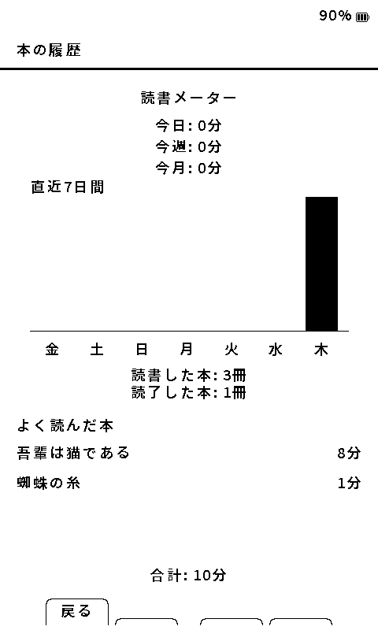

# 本の管理と読書記録

[マニュアルの目次](manual-ja.md)

## ファイルとフォルダ

ファイル一覧でフォルダを選び **決定** で開きます。画面の操作案内に従って前の階層へ戻れます。本はPCからSDカードにコピーするか、[Wi-Fiで転送](wifi-transfer-ja.md)します。

多数の本を含むフォルダは初回表示や戻ったときに再読込が発生する場合があります。処理中にSDカードを抜かずに待ってください。

## 既読・書庫・削除

ファイル一覧で本を選び **決定を長押しして離す** と操作を選べます。画面下部のラベルを確認してください。

- **既読**: 本を読み終えた状態にします。
- **書庫へ**: SDカードの `/Archived/` へ移動します。同名の本がある場合は上書きしません。
- 書庫内の **戻す**: 保存されている元の場所へ戻します。戻せない場合は元のフォルダや同名ファイルを確認してください。
- **削除**: 書籍ファイルを削除します。キャッシュ削除とは異なります。必要な本は先にバックアップしてください。

## 移動・改名と読書データ

EPUBの移動・改名では書籍の識別情報を使って読書位置・しおり・本ごとの設定を引き継ぎます。同じパスのEPUBを更新した際にも引き継ぎ処理があります。別の本に置き換える際は別のファイル名を使い、意図しない引き継ぎを避けてください。

PCで本を整理する前に、SDカード内の必要なデータをバックアップしておくと安心です。更新で章や本文が変わった場合は、再開位置を確認してください。

## 本の履歴と読書メーター

ホームの **本の履歴** には、次の2項目があります。

- **読書履歴**: 最近読んだ本を選び、そのまま読書を再開します。読書時間はここには表示しません。
- **読書メーター**: 今日・今週・今月の読書時間、読書した本・読了した本の冊数を確認します。記録がある場合は、直近7日間の棒グラフとよく読んだ本も表示します。

X3では、読書メーターの概要と詳細が別ページです。画面下の **次へ**／**前へ** に従って移動してください。X4では同じ情報を1画面にまとめて表示します。

棒グラフは、直近7日間に読書時間の記録がある日を表示します。棒の高さはその日の読書時間に応じて変わります。画面の **今日／今週／今月** は集計期間ごとの読書時間で、棒グラフの表示期間とは異なります。

よく読んだ本には、表示上 `0分` になる本は載りません。短時間でも `1分` 以上の記録がある本は表示されます。
